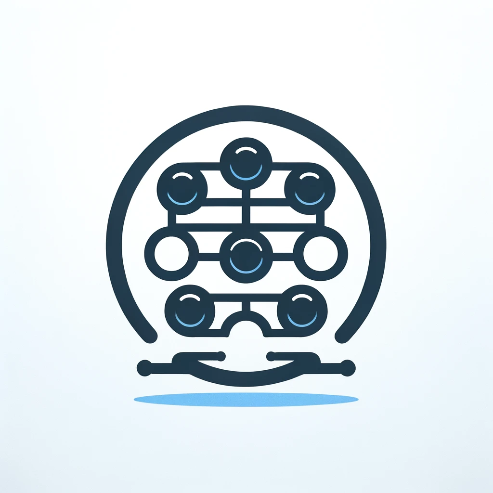

# Lemric Batch Request

<p align="center">
  
</p>

**Batch HTTP API calls into a single request.** Compatible with
[Symfony](https://symfony.com/) 6.4+ / 7 / 8 and [Laravel](https://laravel.com/) 10+.

Send one JSON envelope containing multiple operations. Independent
read-only operations may run in parallel (PHP Fibers); write operations
stay serialised. When every operation finishes, a consolidated JSON
response is returned and the HTTP connection is closed.

---

## Requirements

| Requirement | Version        |
|-------------|----------------|
| PHP         | ≥ 8.2          |
| Symfony\*   | ^6.4 \| ^7 \| ^8 |
| Laravel\*   | ^10 \| ^11 \| ^12 |

\* Framework packages are **optional** — install only the bridge you need.
See [Installation](docs/installation.md).

## Installation

```bash
composer require lemric/batch-request
```

## Quick Start

### Symfony

```php
// config/bundles.php
return [
    // ...
    Lemric\BatchRequest\Bridge\Symfony\BatchRequestBundle::class => ['all' => true],
];
```

```php
use Lemric\BatchRequest\Bridge\Symfony\SymfonyBatchRequestFacade;
use Symfony\Component\HttpFoundation\{Request, Response};
use Symfony\Component\Routing\Attribute\Route;

#[Route('/batch', name: 'batch', methods: ['POST'])]
public function batch(Request $request, SymfonyBatchRequestFacade $batch): Response
{
    return $batch->handle($request);
}
```

> **Note:** The legacy `Lemric\BatchRequest\BatchRequest` class is
> deprecated and will be removed in 3.2. Prefer
> `SymfonyBatchRequestFacade`.

### Laravel

```php
// bootstrap/providers.php (Laravel 11+) or config/app.php
Lemric\BatchRequest\Bridge\Laravel\LaravelServiceProvider::class,
```

```php
use Illuminate\Http\{JsonResponse, Request};
use Lemric\BatchRequest\Bridge\Laravel\LaravelBatchRequestFacade;

public function __invoke(Request $request, LaravelBatchRequestFacade $batch): JsonResponse
{
    return $batch->handle($request);
}
```

### Example request

```bash
curl -X POST https://example.com/batch \
  -H 'Content-Type: application/json' \
  -d '[
    {"method":"GET","relative_url":"/api/users/1"},
    {"method":"GET","relative_url":"/api/users/2"},
    {"method":"POST","relative_url":"/api/posts","body":{"title":"Hello"}}
  ]'
```

### Example response

```json
[
  {"code": 200, "body": {"id": 1, "name": "Alice"}},
  {"code": 200, "body": {"id": 2, "name": "Bob"}},
  {"code": 201, "body": {"id": 42, "title": "Hello"}}
]
```

The order of responses **always** matches the order of operations.

## Documentation

| Topic | Description |
|-------|-------------|
| [Installation](docs/installation.md) | Composer setup, optional dependencies |
| [Usage](docs/usage.md) | Request / response protocol |
| [Responses](docs/responses.md) | Content types, binary payloads, headers |
| [Errors](docs/errors.md) | Sub-request failures & top-level errors |
| [Security](docs/security.md) | Hardening model & threat mitigations |
| [Architecture](docs/architecture.md) | Handler, Fibers, validators |
| [Symfony integration](docs/symfony/index.md) | Bundle, configuration, profiler, rate limiting |
| [Laravel integration](docs/laravel/index.md) | Service provider, configuration, controller |

Full table of contents: **[docs/index.md](docs/index.md)**.

## Features

* **Framework bridges** for Symfony (`BatchRequestBundle`) and Laravel
* **Fiber-based concurrency** for contiguous read-only (`GET` / `HEAD`)
  groups, with bounded concurrency
* **OWASP-oriented validation** (path traversal, CRLF, SSRF, recursive
  batches, header injection)
* **RFC 7807** problem documents for failed sub-responses and top-level
  errors
* **Mixed media types** in one batch (JSON, HTML, XML, binary/base64,
  `BinaryFileResponse`, `StreamedResponse`)
* **Symfony Web Profiler** panel (dev)
* Optional **rate limiting** via `symfony/rate-limiter`

## Security

If you discover a security vulnerability, please follow the process
described in [SECURITY.md](SECURITY.md). Do **not** open a public issue.

## Contributing

* Run the test suite: `composer test`
* Static analysis: `composer analyse`
* Bug reports and pull requests are welcome on
  [GitHub](https://github.com/Lemric/BatchRequest).

## License

This package is released under the [MIT license](LICENSE).
